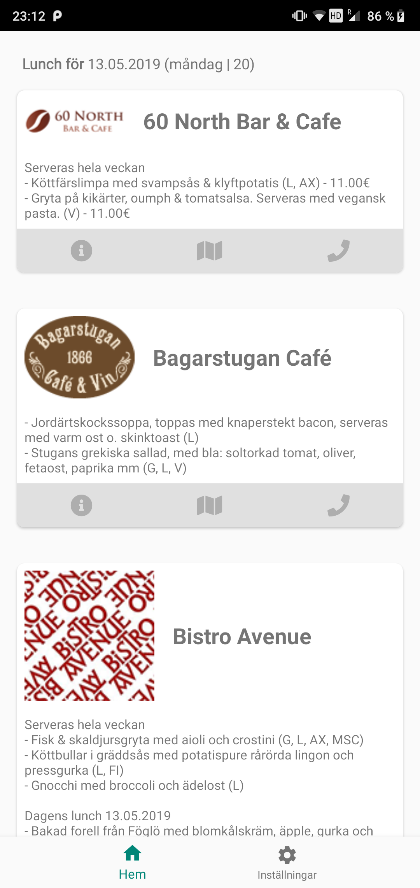
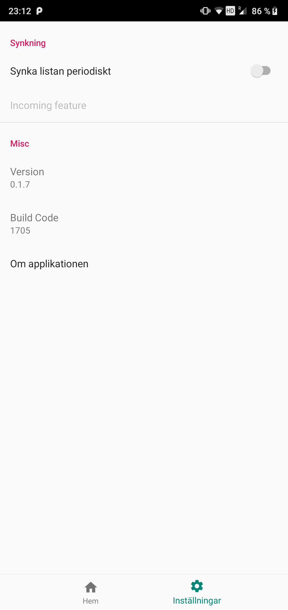

# Lunch Lista
The idea of this app is to be able to check daily of what lunch that the various lunch places around town is offering.

It's using [Lunch-Meny](https://github.com/mauritzn/Lunch-Meny) in order to be able to fetch the current day's lunch menu.

The app serves as a challenge to be able to make something good in a rather short amount of time.

Screenshots:

### The home view:

### The settings view:
